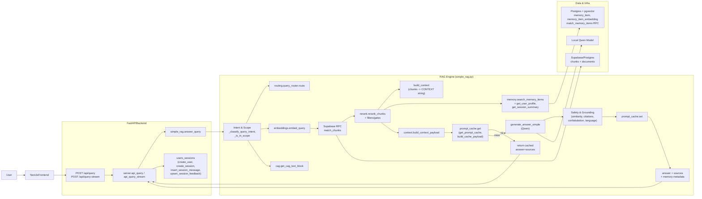

## Backend Architecture Overview

This document summarizes the current backend architecture for the SAMA/NORA RAG assistant, including the main components, request flow, and data paths.

### 1. High‑Level Components

- **FastAPI service** (`backend/server.py`):
  - Exposes HTTP endpoints: `/api/user`, `/api/session`, `/api/query`, `/api/query-stream`, `/api/feedback`, `/health`.
  - Orchestrates user/session lifecycle and delegates RAG logic to `simple_rag.answer_query`.
- **RAG engine** (`backend/simple_rag.py`):
  - End‑to‑end pipeline: intent & scope detection, retrieval, reranking, similarity gates, memory integration, LLM generation, and safety/grounding.
  - Uses configuration from `backend/config.py` for all thresholds and feature flags.
- **LLM integration** (`backend/qwen_model.py`):
  - Loads a local Qwen model and tokenizer used by `generate_answer_simple`.
- **Memory subsystem** (`backend/memory.py` + SQL in `backend/sql/`):
  - Manages `user_profile`, `session_summary`, and episodic `memory_item` + `memory_item_embedding` with pgvector.
  - Provides `search_memory_items`, `update_profile_from_exchange`, `maybe_write_episodic_from_exchange`, `maybe_update_session_summary`.
- **CAG layer** (`backend/cag/cached_knowledge.py`):
  - Maintains cached knowledge (`CachedKnowledge`) with system rules and domain background.
  - Provides `get_cag_text_block` used to prepend stable instructions to the system prompt.
- **Prompt cache** (`backend/cache/prompt_cache.py`):
  - Abstract `BasePromptCache` with in‑memory and Redis implementations.
  - Exposes `get_prompt_cache`, `build_cache_payload` to reuse full RAG+LLM results based on logical context.
- **Structured context layer** (`backend/context/context_builder.py`):
  - Defines `ContextPayload` and `build_context_payload` to capture a compact, structured view of documents, memory, profile, and CAG for caching/logging.
- **Query router** (`backend/routing/query_router.py`):
  - `route(query, metadata)` returns a simple route label (`rag`, `cag_only`, `hybrid`) based on greetings and intent.

### 2. System Diagram (C4 Container‑Level)

### 3. Request Lifecycle (Non‑Streaming `/api/query`)

1. **HTTP request in**:
   - Frontend sends `POST /api/query` with `{"query", "user_id"?, "session_id"?}`.
2. **User/session handling** (`server.api_query`):
   - If `user_id` missing → `create_user()` and mark as newly created.
   - If `session_id` missing → `create_session(user_id)` and mark as newly created.
3. **Delegate to RAG engine**:
   - Calls `simple_rag.answer_query(query, user_id, session_id)`.
4. **Intent & scope**:
   - `_classify_query_intent` labels query as `fact_definition`, `metadata`, `procedural`, `synthesis`, or `other`.
   - `_is_in_scope` checks domain keywords vs greetings/off‑topic patterns.
   - If out‑of‑scope → returns an out‑of‑scope message immediately.
5. **Query routing**:
   - `routing.query_router.route(query, {"intent": intent})`:
     - Greetings → `cag_only`.
     - Some intents (e.g. synthesis/procedural) → `hybrid`.
     - Else → `rag`.
6. **Retrieval**:
   - Normalize & embed query via `normalize_query_for_embedding` and `embed_query`.
   - Call Supabase RPC `match_chunks` (`fetch_chunks`) with top‑k tuned per intent.
   - Optional dynamic top‑k, dual retrieval for Arabic, second‑pass retrieval, and RRF merges.
   - Apply reranking (`rerank_chunks`), Arabic‑first ordering, and query‑term‑first ordering.
   - Apply similarity gates and language consistency checks to reject low‑quality retrieval.
7. **Context building**:
   - `build_context(chunks)` creates a `[Passage i]` style CONTEXT string used by Qwen.
8. **Conversation history & memory**:
   - If `session_id` present → load recent conversation via `get_session_message_history`.
   - If memory enabled and `user_id` present:
     - `get_user_profile(user_id)` for preferences (language, strictness, topics).
     - `get_session_summary(session_id)` for rolling transcript.
     - `search_memory_items(user_id, query)` for episodic memory via `match_memory_items` RPC or Python fallback.
9. **CAG & structured context**:
   - `get_cag_text_block({"intent": intent, "route": route_label})` returns cached knowledge (system rules + domain background).
   - `build_context_payload(...)` constructs a `ContextPayload` with:
     - Query, intent, in_scope, route.
     - Compact document list (names, pages, similarity).
     - Compact memory list (ids, type, similarity).
     - Profile, session summary, CAG text.
10. **Prompt cache lookup**:
    - `get_prompt_cache()` returns either `InMemoryPromptCache` or `RedisPromptCache` depending on `CACHE_BACKEND` and `REDIS_URL`.
    - `build_cache_payload(...)` builds a small logical context dict (query, intent, route, doc keys, memory keys, profile fingerprint).
    - `cache.build_key(payload)` hashes this into `prompt:<sha256>`.
    - If `cache.get(key)` hits:
      - Optionally streams cached answer via `on_chunk`.
      - Returns cached result without re‑running retrieval or Qwen.
11. **LLM generation** (cache miss path):
    - For some intents (fact/metadata) and flags → `build_extractive_answer`.
    - Else:
      - `generate_answer_simple` assembles:
        - System prompt from config + CAG block.
        - USER CONTEXT block (profile, session summary, memory items) marked as non‑regulatory.
        - Optional conversation history block.
        - `### CONTEXT` + retrieved regulatory passages.
        - `### QUESTION` + user question.
      - Calls Qwen via `model.generate` with `TextIteratorStreamer` to support streaming.
12. **Post‑generation safety & grounding**:
    - Applies multiple validators:
      - Post‑gen similarity between answer and chunks.
      - Citation presence and validity.
      - Entity containment (for definitions/metadata).
      - Semantic grounding (answer vs context embeddings).
      - Confabulation and generic‑phrase blocklists.
      - Language enforcement for Arabic answers.
      - Minimum combined confidence gate (retrieval + grounding + citations).
13. **Result assembly & caching**:
    - Deduplicates sources by `(document_name, page_start, page_end)` with snippets.
    - Attaches `cited_sentences`, `cited_articles`, `session_summary` text, and `memory_used` summary when enabled.
    - If prompt cache is enabled and a key was built → `cache.set(key, result)`.
14. **Persistence & memory writes** (back in `server.api_query`):
    - Inserts `session_messages` row via `insert_session_message`.
    - Best‑effort memory updates:
      - `update_profile_from_exchange` (user preferences).
      - `maybe_update_session_summary` (rolling session transcript).
      - `maybe_write_episodic_from_exchange` (episodic preference memory).
15. **HTTP response**:
    - Returns JSON containing `answer`, `sources`, `message_id`, `user_id`, `session_id`, and flags indicating if IDs were created.

### 4. Streaming Lifecycle (`/api/query-stream`)

- Uses the same `answer_query` pipeline with an `on_chunk` callback wired into Qwen’s streaming.
- Streams JSON lines:
  - `{ "type": "chunk", "text": "<partial answer>" }` as tokens arrive.
  - At the end:
    - Persists the exchange and performs the same memory writes as non‑streaming.
    - Sends `{ "type": "meta", "meta": { user_id, session_id, message_id, sources, ... } }`.
    - Sends `{ "type": "done" }`.

### 5. Key Configuration Flags

- **Core RAG**:
  - `SIMPLE_RAG_TOP_K`, `SIMPLE_RAG_TOP_K_SYNTHESIS`, `TOP_K_DEFINITION`.
  - `MIN_CHUNK_SIMILARITY*`, `MIN_CHUNK_SIMILARITY_STRICT`.
  - `ENABLE_RERANKING`, `ENABLE_SECOND_PASS_RETRIEVAL`, `ENABLE_ARABIC_DUAL_RETRIEVE`.
- **Memory**:
  - `ENABLE_MEMORY_SYSTEM`, `ENABLE_EPISODIC_MEMORY_WRITES`.
  - `MEMORY_TOP_K`, `MEMORY_MAX_CHARS`, `SESSION_SUMMARY_UPDATE_EVERY_N_MESSAGES`.
- **CAG / Routing / Cache / Context**:
  - `ENABLE_CAG` – prepend cached knowledge to system prompt.
  - `ENABLE_QUERY_ROUTER` – enable route labels (`rag`, `cag_only`, `hybrid`).
  - `ENABLE_STRUCTURED_CONTEXT` – build `ContextPayload`.
  - `ENABLE_PROMPT_CACHE` – enable prompt/result caching.
  - `CACHE_ENABLED`, `CACHE_TTL_SECONDS`, `CACHE_BACKEND`, `REDIS_URL`.

This architecture keeps the original RAG pipeline intact while adding CAG, prompt caching, and structured context as **modular layers** that can be toggled and evolved without breaking existing behavior.

