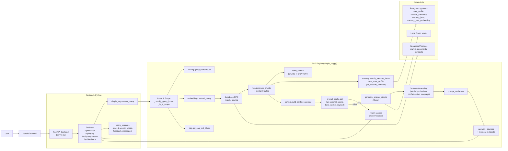

## System Architecture Overview

This document describes the **full end‑to‑end architecture** of the SAMA/NORA RAG assistant:

- Frontend (Next.js + React)
- Backend (FastAPI + RAG + memory + CAG + prompt cache)
- Database layer (Supabase/Postgres + pgvector), including key tables and columns

It is intended as a **one‑stop onboarding doc** for new engineers.

---

## 1. High‑Level System Diagram



---

## 2. Frontend Architecture (Next.js + React)

### 2.1 Tech stack

- **Framework**: Next.js (App Router) with React and TypeScript.
- **Styling**: Tailwind CSS + shadcn/ui (from previous context).
- **State types**: `frontend/lib/types.ts`.

```12:30:frontend/lib/types.ts
export interface Reference {
  id: string;
  source: string;
  page: number;
  snippet: string;
}

export interface Message {
  id: string;
  role: 'user' | 'assistant';
  content: string;
  references?: Reference[];
  timestamp: Date;
  /** Backend message_id for feedback (session_messages.message_id). */
  messageId?: string;
  /** Optional session summary text returned with this assistant message. */
  sessionSummary?: string;
  /** Optional list of memory items used when generating this answer (debug/inspection only). */
  memoryUsed?: { type: string; text: string }[];
}

export interface Chat {
  id: string;
  title: string;
  messages: Message[];
  createdAt: Date;
  updatedAt: Date;
  /** Backend session_id; set after first query response. */
  serverSessionId?: string;
}
```

### 2.2 Frontend responsibilities

- Render chat UI (user vs assistant bubbles) and dashboard panels.
- Maintain local chat state (`Chat`, `Message`), including:
  - References per message (document, page, snippet).
  - `messageId` for sending feedback.
  - Optional session summary and memoryUsed metadata surfaced from backend.
- Call backend endpoints:
  - `POST /api/user` to create a user on first visit or anonymous session.
  - `POST /api/session` to create a chat session tied to a user.
  - `POST /api/query` for normal (non‑streaming) responses.
  - `POST /api/query-stream` for streaming answers (e.g., via EventSource).
  - `POST /api/feedback` to send a rating + comments for a specific `messageId`.
- Render sources for each assistant message:
  - Show document name, page number, and snippet for each reference.

### 2.3 Frontend data flow (simplified)

1. On app load, frontend checks if a `user_id` is stored locally; if not, calls `/api/user`.
2. On first chat message, frontend:
   - If no `session_id` → calls `/api/session` to create one.
   - Sends `POST /api/query` or `/api/query-stream` with `{ query, user_id, session_id }`.
3. When the response arrives:
   - Appends a new `Message` with:
     - `content` ← `answer`
     - `references` ← mapped from `sources`
     - `messageId` ← `message_id`
     - `sessionSummary`, `memoryUsed` (if present).
   - Updates `Chat.serverSessionId` to the backend `session_id`.
4. Feedback modal or UI element posts `FeedbackBody` to `/api/feedback` referencing `messageId`.

---

## 3. Backend Architecture (FastAPI + RAG + Memory + CAG + Cache)

This section summarizes the backend view from `docs/backend-architecture.md` and extends it where needed.

### 3.1 FastAPI service (`backend/server.py`)

Key endpoints:

- **`POST /api/user`**
  - Creates a new user via `users_sessions.create_user()`.
  - Returns `{ "user_id": <uuid> }`.

- **`POST /api/session`**
  - Body: `{ "user_id": <uuid> }`.
  - Calls `users_sessions.create_session(user_id)` and returns `{ "session_id": <uuid> }`.

- **`POST /api/query`** (non‑streaming)
  - Validates input; ensures `user_id` and `session_id`, creating them if needed.
  - Calls:

    ```python
    result = answer_query(body.query, user_id=user_id, session_id=session_id)
    ```

  - Extracts `answer` and `sources`.
  - Persists exchange via `insert_session_message(session_id, user_id, user_message, assistant_message)`.
  - Triggers best‑effort memory writes (fail‑soft):
    - `update_profile_from_exchange(user_id, session_id, user_message, assistant_message)`
    - `maybe_update_session_summary(session_id, user_id)`
    - `maybe_write_episodic_from_exchange(user_id, session_id, user_message, assistant_message, source_message_id=message_id)`
  - Returns `answer`, `sources`, `message_id`, `user_id`, `session_id`, and flags indicating new IDs.

- **`POST /api/query-stream`** (streaming)
  - Same user/session initialization as `/api/query`.
  - Wraps `answer_query` in a background thread and streams text chunks using `on_chunk` callback.
  - After streaming finishes:
    - Persists message and runs the same memory update functions.
    - Streams a final `meta` event and a `done` event.

- **`POST /api/feedback`**
  - Reads a stored message via `get_message_by_id(message_id)`.
  - Upserts feedback into `session_feedback` (see DB tables below) using `upsert_session_feedback`.

- **`GET /health`**
  - Simple health check returning `{ "status": "ok" }`.

### 3.2 RAG engine (`backend/simple_rag.py`)

Core responsibilities:

- *Query understanding*:
  - `_classify_query_intent` → `fact_definition`, `metadata`, `procedural`, `synthesis`, `other`.
  - `_is_in_scope` → domain gate for SAMA/NORA vs off‑topic/greetings.
  - Arabic detection helpers: `_is_arabic_query`, `_chunk_has_arabic_content`, etc.

- *Retrieval*:
  - `normalize_query_for_embedding` from `query_normalize.py`.
  - `embed_query` from `embeddings.py`.
  - `fetch_chunks(query_embedding, limit)`:
    - Calls Supabase RPC `match_chunks` to retrieve regulatory chunks.
  - Optional:
    - Dynamic top‑k re‑fetch when top similarity is low.
    - Dual retrieval for Arabic queries (Arabic + translated English).
    - Second‑pass retrieval with increased top‑k + RRF merge.
  - Reranking via `rerank.rerank_chunks` and additional heuristics (definitions first, Arabic‑first, query‑term‑first).
  - Multiple similarity gates to reject low‑quality retrieval.

- *Context assembly*:
  - `build_context(chunks)` → `[Passage i] Document: ..., Pages: ..., Article: ...` style block.
  - `build_context_payload(...)` (structured, non‑prompt view) from `context/context_builder.py`.

- *Memory integration*:
  - Fetches:
    - Conversation history via `users_sessions.get_session_message_history`.
    - Profile via `memory.get_user_profile`.
    - Session summary via `memory.get_session_summary`.
    - Episodic memory items via `memory.search_memory_items` (RPC `match_memory_items` or Python fallback).

- *CAG and routing*:
  - Route label (`"rag"`, `"cag_only"`, `"hybrid"`) from `routing.query_router.route(query, {"intent": intent})`.
  - CAG block (`### SYSTEM RULES` + `### DOMAIN BACKGROUND`) from `cag.get_cag_text_block`.
  - These are fused into the system prompt and structured context.

- *Prompt caching*:
  - `get_prompt_cache()` returns a `BasePromptCache` instance:
    - `InMemoryPromptCache` (process‑local).
    - Or `RedisPromptCache` (shared) using `REDIS_URL`.
  - `build_cache_payload(...)` captures:
    - Query, intent, in_scope, route.
    - Document keys: `(document_name, page_start, page_end)`.
    - Memory keys: memory item IDs.
    - Profile fingerprint: preferred_language + strictness_level.
  - `cache.build_key(payload)` turns this into `prompt:<sha256>`.
  - On cache hit:
    - Returns stored result and optionally streams the cached answer.
  - On cache miss:
    - Normal RAG + Qwen pipeline runs.
    - Final result stored back into cache with TTL.

- *Generation & post‑processing*:
  - `generate_answer_simple`:
    - Loads Qwen via `_load_qwen` from `qwen_model.py`.
    - Constructs system prompt based on:
      - Base system prompt from config.
      - CAG block (system rules + domain background).
      - Intent‑specific supplements (definition, metadata, synthesis, law summary).
      - Jurisdiction anchor.
      - Arabic suffix for Arabic queries.
    - Builds USER CONTEXT from profile, session summary, and episodic memory items (explicitly non‑regulatory).
    - Optionally appends recent conversation history.
    - Injects `### CONTEXT` (regulatory passages) and `### QUESTION`.
    - Streams partial text via `TextIteratorStreamer` and `on_chunk`.
    - Strips instruction echoes, filler, CJK noise, markdown links, and ensures answer formatting.
  - `answer_query` then runs:
    - Post‑gen similarity checks (answer vs context).
    - Citation validation and fallback.
    - Entity containment checks.
    - Confabulation and generic phrase removal.
    - Semantic grounding via `grounding_decision`.
    - Minimum confidence gating.
  - Finally:
    - Builds `sources` list.
    - Optionally attaches:
      - `session_summary` text and `memory_used`.
      - Confidence and `citation_valid`.

### 3.3 Memory subsystem (`backend/memory.py`)

Functions:

- **Profiles**
  - `get_user_profile(user_id)` / `upsert_user_profile(user_id, **fields)`:
    - Read/write `user_profile` table (preferred_language, strictness_level, topics, flags, etc.).

- **Session summaries**
  - `get_session_summary(session_id)` / `upsert_session_summary(...)`:
    - Manage `session_summary` rows (summary_text, summary_json, message_count).

- **Episodic memory**
  - `insert_memory_item(user_id, session_id, type_, text, metadata?, source_message_id?)`:
    - Inserts into `memory_item` table if text is long enough.
  - `embed_memory_item(memory_item_id, text)`:
    - Embeds text using `embed_chunk` and upserts into `memory_item_embedding`.

- **Memory search**
  - `search_memory_items(user_id, query, top_k)`:
    - Preferred path: calls Supabase RPC `match_memory_items` (see DB section below).
    - Fallback path:
      - Loads last N `memory_item` rows for the user.
      - Loads corresponding embeddings from `memory_item_embedding`.
      - Computes cosine similarity in Python.
      - Returns top_k items annotated with `similarity`.

- **Preference extraction & episodic writes**
  - `_detect_preferences_from_exchange(user_message)`:
    - Looks for phrases that signal language preference, strictness, and topics (license, AML, KYC, etc.).
  - `update_profile_from_exchange(user_id, session_id, user_message, assistant_message)`:
    - Reads existing `user_profile`.
    - Updates `preferred_language`, `strictness_level`, and `topics` as needed.
  - `maybe_write_episodic_from_exchange(user_id, session_id, user_message, assistant_message, source_message_id)`:
    - Builds a short natural‑language preference summary (e.g. “User prefers Arabic answers. User wants stricter answers. User interested in: aml, kyc.”).
    - Writes it as a `memory_item` of type `preference` and embeds it.

- **Session summary updates**
  - `maybe_update_session_summary(session_id, user_id)`:
    - Counts messages from `session_messages`.
    - Every `SESSION_SUMMARY_UPDATE_EVERY_N_MESSAGES`, builds a transcript from last 20 exchanges and writes/truncates it into `session_summary.summary_text`.

---

## 4. Database Schema (Supabase/Postgres + pgvector)

The SQL files in `backend/sql/` define the main relational schema:

```1:4:backend/sql/001_user_session_tables.sql
-- (not shown here, but defines "user", "session", "session_messages", "session_feedback" tables)
```

```1:54:backend/sql/003_memory_tables.sql
-- Memory-related tables: user_profile, session_summary, memory_item, memory_item_embedding.
-- Run in Supabase SQL Editor after 001_user_session_tables.sql and 002_feedback_stars_and_messages.sql.
...
CREATE TABLE IF NOT EXISTS user_profile (
  user_id UUID PRIMARY KEY REFERENCES "user"(user_id) ON DELETE CASCADE,
  preferred_language TEXT, -- e.g. 'en' or 'ar'
  strictness_level SMALLINT CHECK (strictness_level BETWEEN 1 AND 5),
  topics TEXT[],           -- e.g. {'licensing','capital'}
  flags JSONB,             -- extensible bag for boolean/other preferences
  created_at TIMESTAMPTZ DEFAULT NOW(),
  updated_at TIMESTAMPTZ DEFAULT NOW()
);
...
CREATE TABLE IF NOT EXISTS session_summary (
  session_id UUID PRIMARY KEY REFERENCES session(session_id) ON DELETE CASCADE,
  user_id UUID NOT NULL REFERENCES "user"(user_id) ON DELETE CASCADE,
  summary_text TEXT,
  summary_json JSONB,
  message_count INTEGER DEFAULT 0,
  updated_at TIMESTAMPTZ DEFAULT NOW()
);
...
CREATE TABLE IF NOT EXISTS memory_item (
  id UUID PRIMARY KEY DEFAULT gen_random_uuid(),
  user_id UUID NOT NULL REFERENCES "user"(user_id) ON DELETE CASCADE,
  session_id UUID REFERENCES session(session_id) ON DELETE CASCADE,
  type TEXT NOT NULL,              -- e.g. 'preference','decision','entity','clarification'
  text TEXT NOT NULL,              -- short description of the memory
  metadata JSONB,                  -- structured details (preference_key, entity name, etc.)
  source_message_id UUID REFERENCES session_messages(message_id) ON DELETE SET NULL,
  created_at TIMESTAMPTZ DEFAULT NOW()
);
...
CREATE TABLE IF NOT EXISTS memory_item_embedding (
  memory_item_id UUID PRIMARY KEY REFERENCES memory_item(id) ON DELETE CASCADE,
  embedding vector(384), -- default to 384 (multilingual-e5-small); update if EMBEDDING_DIMENSION changes
  created_at TIMESTAMPTZ DEFAULT NOW()
);
```

### 4.1 Core user/session tables (001 / 002 SQL files)

While the full SQL is not in the snippet above, the code in `users_sessions.py` and `server.py` implies the following tables:

- **`user`**
  - `user_id UUID PRIMARY KEY`
  - `created_at TIMESTAMPTZ DEFAULT NOW()`
  - Other audit fields as needed.

- **`session`**
  - `session_id UUID PRIMARY KEY`
  - `user_id UUID REFERENCES user(user_id)`
  - `created_at TIMESTAMPTZ DEFAULT NOW()`

- **`session_messages`**
  - `message_id UUID PRIMARY KEY`
  - `session_id UUID REFERENCES session(session_id)`
  - `user_id UUID REFERENCES user(user_id)`
  - `user_message TEXT`
  - `assistant_message TEXT`
  - `created_at TIMESTAMPTZ DEFAULT NOW()`

- **`session_feedback`** (from `002_feedback_stars_and_messages.sql`)
  - `session_id UUID REFERENCES session(session_id)`
  - `user_id UUID REFERENCES user(user_id)`
  - `message_id UUID REFERENCES session_messages(message_id)`
  - `feedback SMALLINT` (1–5 rating)
  - `comments TEXT`
  - `user_message TEXT` (denormalized for auditing)
  - `assistant_message TEXT` (denormalized)
  - `created_at TIMESTAMPTZ`
  - `updated_at TIMESTAMPTZ`

These are managed by:

- `users_sessions.create_user`
- `users_sessions.create_session`
- `users_sessions.insert_session_message`
- `users_sessions.get_message_by_id`
- `users_sessions.upsert_session_feedback`

### 4.2 Memory tables (`003_memory_tables.sql`)

As seen above:

- **`user_profile`**
  - `user_id UUID PRIMARY KEY REFERENCES user(user_id)`
  - `preferred_language TEXT` – e.g. `'en'` or `'ar'`
  - `strictness_level SMALLINT CHECK (1–5)`
  - `topics TEXT[]` – user’s interest topics
  - `flags JSONB` – arbitrary configuration/flags
  - `created_at`, `updated_at`

- **`session_summary`**
  - `session_id UUID PRIMARY KEY REFERENCES session(session_id)`
  - `user_id UUID NOT NULL REFERENCES user(user_id)`
  - `summary_text TEXT` – truncated transcript or summary
  - `summary_json JSONB` – room for structured summaries
  - `message_count INTEGER`
  - `updated_at TIMESTAMPTZ`

- **`memory_item`**
  - `id UUID PRIMARY KEY DEFAULT gen_random_uuid()`
  - `user_id UUID NOT NULL REFERENCES user(user_id)`
  - `session_id UUID REFERENCES session(session_id)`
  - `type TEXT NOT NULL` – e.g. `'preference'`, `'decision'`, `'entity'`
  - `text TEXT NOT NULL` – description of the memory
  - `metadata JSONB` – structured hints
  - `source_message_id UUID REFERENCES session_messages(message_id)`
  - `created_at TIMESTAMPTZ`

- **`memory_item_embedding`**
  - `memory_item_id UUID PRIMARY KEY REFERENCES memory_item(id)`
  - `embedding vector(384)` – pgvector column, dimension kept in sync with `EMBEDDING_DIMENSION`
  - `created_at TIMESTAMPTZ`

Indexes:

- `idx_session_summary_user_id` on `session_summary(user_id)`.
- `idx_memory_item_user_id` and `idx_memory_item_session_id`.
- `idx_memory_item_embedding_vector` (ivfflat index on embedding).

### 4.3 Memory match RPC (`004_memory_match_rpc.sql`)

```1:31:backend/sql/004_memory_match_rpc.sql
CREATE OR REPLACE FUNCTION match_memory_items(
  query_embedding vector(384),
  match_count INT,
  match_user_id UUID
)
RETURNS TABLE (
  memory_item_id UUID,
  user_id UUID,
  session_id UUID,
  type TEXT,
  text TEXT,
  metadata JSONB,
  similarity FLOAT
) AS $$
  SELECT
    mi.id AS memory_item_id,
    mi.user_id,
    mi.session_id,
    mi.type,
    mi.text,
    mi.metadata,
    1 - (mie.embedding <=> query_embedding) AS similarity
  FROM memory_item_embedding mie
  JOIN memory_item mi ON mi.id = mie.memory_item_id
  WHERE mi.user_id = match_user_id
  ORDER BY mie.embedding <=> query_embedding
  LIMIT match_count;
$$ LANGUAGE sql STABLE;
```

This function is used by `memory.search_memory_items` to efficiently retrieve the top‑k episodic memories for a given user ordered by semantic similarity.

### 4.4 Chunk and document storage (Supabase)

While not shown in the snippets above, the ingestion scripts and RAG engine imply tables like:

- **`documents`**
  - `id`
  - `document_name`
  - `source_path`
  - `document_type`
  - `created_at`, `updated_at`

- **`chunks`** or `document_chunks`
  - `id`
  - `document_id` or `document_name`
  - `content TEXT`
  - `section_title TEXT`
  - `page_start INT`, `page_end INT`
  - `article_id` / `article_number`
  - `embedding vector(EMBEDDING_DIMENSION)` (for `match_chunks` RPC)
  - Other metadata required by RAG (e.g., language, document_type flags)

These are not directly managed in code at query time; instead:

- Retrieval uses `SupabaseClient.rpc("match_chunks", ...)` in `simple_rag.fetch_chunks`.
- Ingestion scripts under `backend/scripts/` (`process_pdfs_batch.py`, `extract_text.py`, `chunk_text.py`, `generate_embeddings.py`, `upload_to_db.py`, etc.) populate and refresh this corpus.

---

## 5. Feature Summary by Layer

### 5.1 Frontend

- Next.js App Router, React, TypeScript.
- Chat UI with:
  - Multiple chats (`Chat`), each with messages and optional `serverSessionId`.
  - Rich `Message` metadata: references, sessionSummary, memoryUsed, backend messageId.
- Integration with backend:
  - User creation, session creation.
  - Normal and streaming queries.
  - Star ratings and optional feedback comments.

### 5.2 Backend

- FastAPI service with clear REST endpoints.
- RAG engine with:
  - Intent classification and domain gating.
  - Embedding and Supabase vector search.
  - Reranking, similarity gates, and domain‑specific heuristics.
  - Memory integration (profiles, summaries, episodic memory).
  - CAG (cached knowledge) prepended to system prompt.
  - Query routing (`rag`, `cag_only`, `hybrid`).
  - Prompt caching (in‑memory or Redis) keyed by logical context.
  - Rich post‑processing: grounding, citations, language, confabulation.
- Config‑driven behavior:
  - Thresholds and switches for almost every stage.
  - Dedicated feature flags:
    - `ENABLE_CAG`
    - `ENABLE_PROMPT_CACHE`
    - `ENABLE_QUERY_ROUTER`
    - `ENABLE_STRUCTURED_CONTEXT`

### 5.3 Database

- Supabase/Postgres as primary store.
- pgvector extension for:
  - Chunk embeddings (regulation content).
  - Episodic memory embeddings.
- Core tables:
  - `user`, `session`, `session_messages`, `session_feedback`.
  - `user_profile`, `session_summary`, `memory_item`, `memory_item_embedding`.
  - Documents + chunks tables used by the `match_chunks` RPC.
- RPC functions:
  - `match_memory_items` for per‑user episodic memory search.
  - `match_chunks` for regulatory RAG retrieval (defined on the Supabase side).

This architecture gives you a **modular, highly configurable RAG + memory system** where:

- The frontend is a thin client for interaction and visualization.
- The backend encapsulates all retrieval, memory, and LLM logic.
- The database provides both long‑term structured memory and vectorized search over documents and episodic memory.

